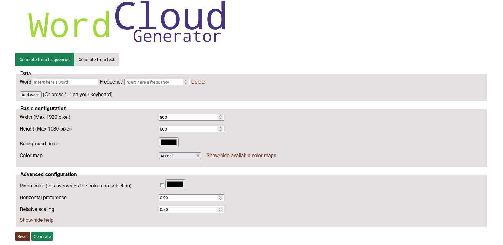

# WordCloud Generator



This repository contains the source code of Wordcloud Generator, a web app based on the popular [WordCloud](http://amueller.github.io/word_cloud/) Python package.

The application is currently deployed at [https://wordcloud.fly.dev/](https://wordcloud.fly.dev/)

## Local installation

For running it on you local machine, first clone the repo:

```
git clone https://github.com/marcolardera/wordcloud.git
```

Move to the cloned folder:

```
cd wordcloud
```

Then install the requirements:

```
pip3 install -r requirements.txt
```

And finally run it:

```
python3 main.py
```

A local Flask webserver will open, serving the application at http://127.0.0.1:5000/ on your machine.
